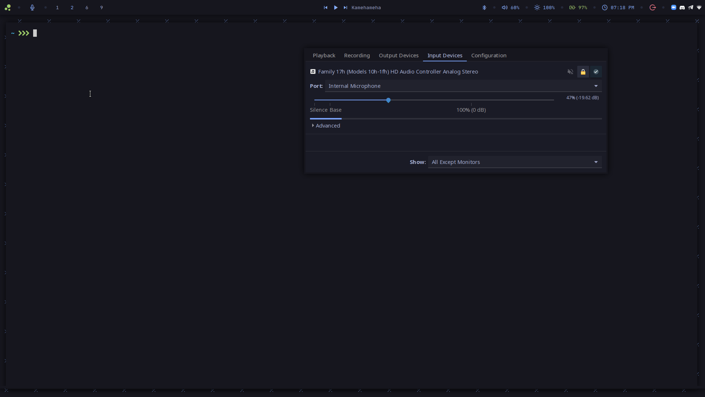

# Polybar Microphone Module
A fully functional Microphone module for polybar that adds an icon that changes dynamically accordingly to the microphone status.

## Dependencies
- Some Icon-font like ttf-icomoon-feather
- pulseaudio-ctl
- pulseaudio
- pavucontrol

You can install them however you like, on arch-based systems: 
```
yay -S pulseaudio pulseaudio-ctl ttf-icomoon-feather pavucontrol 
```

## Installation

Place the shell script files in your preferred sctipt directory.

Add  the module to your polybar config file
```ini
[module/mic]
type = custom/script
tail = true
label-foreground = #ffffff
label-background = #000000
interval = 0

exec = path/to/scripts/mic-tog.sh &
click-left = pulseaudio-ctl mute-input
click-right = pavucontrol -t 4 &
label-padding = 1
label-font = 1


```
## Usage
Left click on the Microphone icon to toggle the microphone status

Right click on the Microphone icon to open the 'Input Devices' tab on pavucontrol to Adjust the input volume.

## module in action

